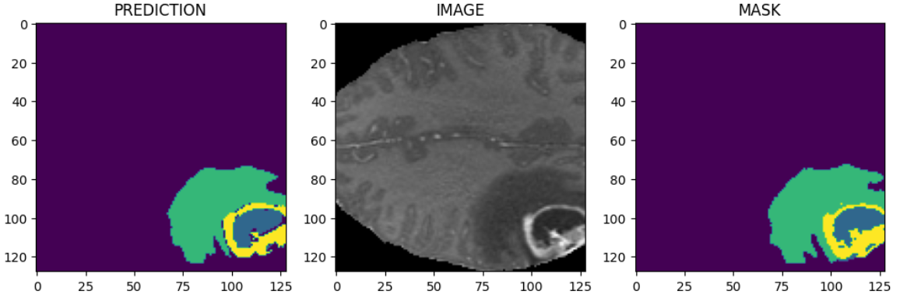

# 🧠 Brain Tumor Segmentation using 3D U-Net

This repository contains the implementation of both a 3D U-Net and a 2D U-Net-based deep learning model for brain tumor segmentation in multi-modal MRI brain scans. The work is part of a Bachelor's thesis at Sapienza Università di Roma.

## 📌 Project Overview

Brain tumor segmentation plays a critical role in diagnosis, treatment planning, and monitoring disease progression. This project compares 2D and 3D U-Net architectures for segmenting glioma sub-regions from the BraTS2021 dataset using PyTorch.

## 🗂️ Contents
- Preprocessed BraTS2021 dataset (MRI modalities and masks)
- Implementation of 2D and 3D U-Net architectures
- Training scripts and hyperparameters
- Jupyter notebooks for visualization and analysis
- Predicted masks, metrics, and visual results

## 🧪 Technologies Used

- Python 3
- PyTorch
- NiBabel
- NumPy, Matplotlib
- BraTS2021 dataset

## 📁 Dataset

The model uses the [BraTS2021] dataset, including 4 MRI modalities:
- T1
- T1ce (contrast-enhanced)
- T2
- FLAIR

each one having its own characteristics and abilities in highlighting a tumor region.

Segmentation labels:  
- `0`: Background  
- `1`: Necrotic core (NCR)  
- `2`: Edema (ED)  
- `3`: Enhancing tumor (ET)

## 🧠 Model Architectures

This project compares:
- 2D U-Net
- 3D U-Net
- 3D U-Net with spatial attention
- 3D U-Net trained on patches

## 📊 Results

Visual comparisons and performance metrics (e.g., Dice Score) demonstrate that 3D U-Net achieves better spatial accuracy but at the cost of higher computational demand.

### 📸 Example Segmentation Output

LEFT: prediction of the implemented model
MIDDLE: original brain scan
RIGHT: mask by the BraTS2021 dataset (by professionals)

<!-- Or using HTML for sizing -->
<!--  -->

## 📈 Metrics

| Model                | Dice Score (WT) | Dice Score (TC) | Dice Score (ET) |
|---------------------|------------------|------------------|------------------|
| 2D U-Net            | 0.78             | 0.70             | 0.66             |
| 3D U-Net            | **0.86**         | **0.81**         | **0.75**         |

> Dice Score is calculated for each class using volumetric overlap with the ground truth.

## 🧠 Highlights

- Incorporating spatial attention shows modest improvements.
- Training on patches improves memory efficiency and regularization.
